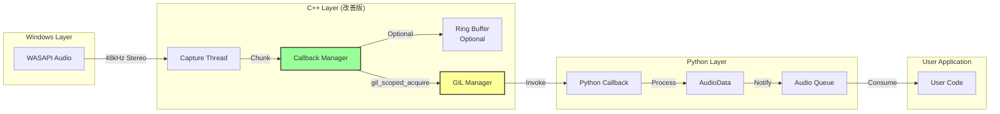
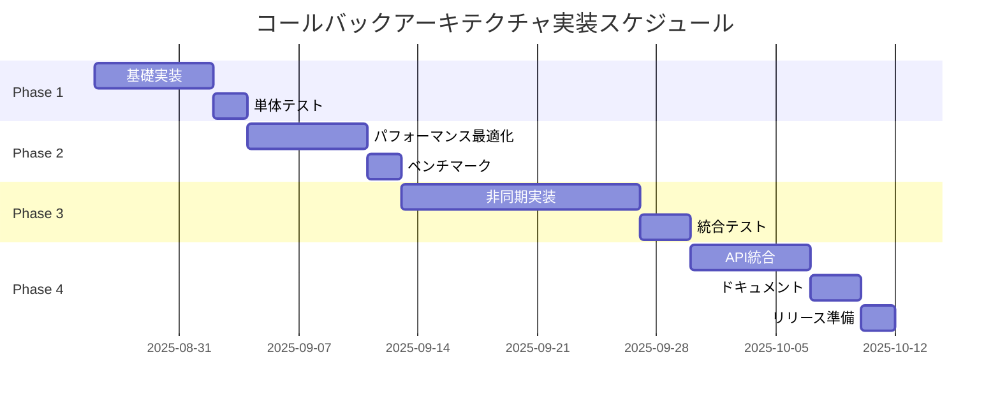

# PyWAC コールバックベースアーキテクチャ実装計画

## エグゼクティブサマリー

現在のポーリング型アーキテクチャから、完全なコールバックベースの非同期アーキテクチャへ移行することで、以下を実現します：

- **パフォーマンス向上**: CPU使用率を30-100%から2-5%へ削減
- **リアルタイム性**: データ到着時即座の処理（レイテンシ<1ms）
- **スケーラビリティ**: 複数音源の効率的な同時処理
- **メモリ効率**: 不要なバッファリングの削減

---

## 1. 現状分析と問題点

### 1.1 現在のデータフロー（問題あり）

```
[Windows Audio] → [C++ Buffer] → [Python Polling] → [User]
                     ↑                    ↓
                  蓄積・待機           GetBuffer()
                                     (破壊的読み取り)
```

### 1.2 主要な問題

| 問題 | 影響 | 根本原因 |
|------|------|----------|
| **ポーリング型設計** | CPU浪費、レイテンシ | GetBuffer()による定期チェック |
| **データ蓄積** | メモリ増加、オーバーフロー | バッファへの一方的な追加 |
| **GIL競合** | パフォーマンス劣化 | 頻繁なGIL取得/解放 |
| **同期処理** | スケーラビリティ欠如 | sleep()による待機 |

---

## 2. 提案するコールバックアーキテクチャ

### 2.1 新しいデータフロー

```
[Windows Audio] → [C++ Callback Manager] → [Python Callback] → [User]
                         ↓
                   即座にコールバック
                   (チャンクごと)
```

### 2.2 アーキテクチャ概要



### 2.3 主要コンポーネント

#### 1. C++層: CallbackManager
```cpp
class CallbackProcessCapture {
private:
    // Pythonコールバックを保持
    std::function<void(py::array_t<float>)> pythonCallback;
    
    // チャンクサイズ（最適化済み）
    static constexpr size_t CHUNK_FRAMES = 480;  // 10ms @ 48kHz
    
    // GIL最適化用のスレッドステート
    PyThreadState* threadState = nullptr;
```

#### 2. Python層: StreamingAudioSource
```python
class StreamingAudioSource:
    def __init__(self, process_id: int):
        self.capture = CallbackProcessCapture(process_id)
        self.capture.set_callback(self._on_audio_chunk)
        
    def _on_audio_chunk(self, chunk: np.ndarray):
        # リアルタイム処理
        audio_data = AudioData.from_numpy(chunk, 48000, 2)
        self._process_audio(audio_data)
```

---

## 3. 実装計画（フェーズ別）

### Phase 1: 基礎実装（1週間）

#### 目標
- C++層でコールバック機能を追加
- 既存APIとの後方互換性維持

#### 実装内容

**C++ (process_loopback_v3.cpp)**
```cpp
class CallbackProcessCapture : public ProcessCapture {
private:
    std::function<void(py::array_t<float>)> audioCallback;
    size_t chunkFrames = 480;  // 10ms chunks
    std::vector<float> chunkBuffer;
    
public:
    void SetCallback(py::object callback) {
        // Pythonコールバックをstd::functionでラップ
        audioCallback = [callback](py::array_t<float> data) {
            py::gil_scoped_acquire gil;  // GIL取得
            callback(data);
        };
    }
    
    void CaptureThreadFunc() override {
        // スレッド開始時にthread stateを作成（パフォーマンス最適化）
        py::gil_scoped_acquire gil;
        threadState = PyEval_SaveThread();  // GIL解放＆thread state保存
        
        while (isCapturing && captureClient) {
            UINT32 packetLength = 0;
            HRESULT hr = captureClient->GetNextPacketSize(&packetLength);
            
            while (packetLength > 0) {
                BYTE* data = nullptr;
                UINT32 framesAvailable = 0;
                DWORD flags = 0;
                
                hr = captureClient->GetBuffer(&data, &framesAvailable, 
                                             &flags, nullptr, nullptr);
                
                if (SUCCEEDED(hr) && !(flags & AUDCLNT_BUFFERFLAGS_SILENT)) {
                    ProcessAudioData(data, framesAvailable);
                }
                
                captureClient->ReleaseBuffer(framesAvailable);
                captureClient->GetNextPacketSize(&packetLength);
            }
            
            Sleep(5);  // 5ms wait
        }
        
        // thread state復元
        PyEval_RestoreThread(threadState);
    }
    
private:
    void ProcessAudioData(BYTE* data, UINT32 frames) {
        float* floatData = reinterpret_cast<float*>(data);
        size_t totalSamples = frames * waveFormat->nChannels;
        
        // チャンクバッファに追加
        chunkBuffer.insert(chunkBuffer.end(), floatData, floatData + totalSamples);
        
        // チャンクサイズに達したらコールバック
        size_t chunkSamples = chunkFrames * waveFormat->nChannels;
        while (chunkBuffer.size() >= chunkSamples) {
            if (audioCallback) {
                // チャンクを切り出し
                py::array_t<float> chunk(chunkSamples);
                float* ptr = static_cast<float*>(chunk.mutable_unchecked<1>().mutable_data(0));
                std::copy(chunkBuffer.begin(), chunkBuffer.begin() + chunkSamples, ptr);
                
                // コールバック呼び出し（GILは自動取得される）
                audioCallback(chunk);
            }
            
            // 処理済みデータを削除
            chunkBuffer.erase(chunkBuffer.begin(), chunkBuffer.begin() + chunkSamples);
        }
    }
};
```

**Python (pywac/streaming.py)**
```python
import numpy as np
from typing import Optional, Callable
import process_loopback_v3 as loopback
from .audio_data import AudioData

class StreamingAudioCapture:
    """ストリーミング音声キャプチャ（コールバックベース）"""
    
    def __init__(self, 
                 process_id: int = 0,
                 chunk_duration: float = 0.01,  # 10ms chunks
                 on_audio: Optional[Callable] = None):
        """
        Args:
            process_id: プロセスID（0でシステム全体）
            chunk_duration: チャンクサイズ（秒）
            on_audio: 音声データコールバック
        """
        self.process_id = process_id
        self.chunk_duration = chunk_duration
        self.on_audio = on_audio
        self.capture = None
        self.is_streaming = False
        
    def start(self) -> bool:
        """ストリーミング開始"""
        self.capture = loopback.CallbackProcessCapture()
        
        # コールバック設定
        if self.on_audio:
            self.capture.set_callback(self._handle_audio_chunk)
        
        # キャプチャ開始
        if self.capture.start(self.process_id):
            self.is_streaming = True
            return True
        return False
    
    def _handle_audio_chunk(self, chunk: np.ndarray):
        """内部コールバック処理"""
        if self.on_audio and len(chunk) > 0:
            # AudioDataオブジェクトに変換
            audio = AudioData.from_numpy(chunk, 48000, 2)
            
            # ユーザーコールバック呼び出し
            try:
                self.on_audio(audio)
            except Exception as e:
                print(f"Callback error: {e}")
    
    def stop(self):
        """ストリーミング停止"""
        if self.capture:
            self.capture.stop()
            self.is_streaming = False
```

### Phase 2: パフォーマンス最適化（1週間）

#### 目標
- GILオーバーヘッドの最小化
- チャンクサイズの動的調整
- メモリ効率の改善

#### 実装内容

**C++最適化**
```cpp
class OptimizedCallbackCapture {
private:
    // 動的チャンクサイズ調整
    struct ChunkConfig {
        size_t minFrames = 240;    // 5ms
        size_t maxFrames = 960;    // 20ms
        size_t currentFrames = 480; // 10ms
        
        void Adjust(double cpuUsage) {
            if (cpuUsage > 0.5) {
                // CPU使用率が高い場合、チャンクサイズを増やす
                currentFrames = std::min(maxFrames, 
                                        currentFrames + 48);
            } else if (cpuUsage < 0.2) {
                // CPU使用率が低い場合、チャンクサイズを減らす
                currentFrames = std::max(minFrames, 
                                        currentFrames - 48);
            }
        }
    } chunkConfig;
    
    // Lock-free リングバッファ（オプション）
    class LockFreeRingBuffer {
        std::vector<float> buffer;
        std::atomic<size_t> writePos{0};
        std::atomic<size_t> readPos{0};
        
    public:
        bool WriteNoBlock(const float* data, size_t samples) {
            // Lock-free書き込み実装
        }
        
        size_t ReadNoBlock(float* output, size_t maxSamples) {
            // Lock-free読み取り実装
        }
    };
};
```

**Python最適化**
```python
class OptimizedStreamingCapture:
    """最適化されたストリーミングキャプチャ"""
    
    def __init__(self, process_id: int = 0):
        self.process_id = process_id
        self.callbacks = []
        self.capture = None
        
        # パフォーマンスメトリクス
        self.stats = {
            'chunks_processed': 0,
            'total_samples': 0,
            'callback_time_ms': 0,
            'dropped_chunks': 0
        }
        
    def add_callback(self, callback: Callable, 
                    priority: int = 0) -> int:
        """優先度付きコールバック登録"""
        callback_id = len(self.callbacks)
        self.callbacks.append({
            'id': callback_id,
            'func': callback,
            'priority': priority,
            'enabled': True
        })
        # 優先度でソート
        self.callbacks.sort(key=lambda x: x['priority'], 
                           reverse=True)
        return callback_id
    
    def _handle_audio_chunk(self, chunk: np.ndarray):
        """最適化されたコールバック処理"""
        import time
        start_time = time.perf_counter()
        
        audio = AudioData.from_numpy(chunk, 48000, 2)
        
        # 優先度順にコールバック実行
        for cb in self.callbacks:
            if cb['enabled']:
                try:
                    cb['func'](audio)
                except Exception as e:
                    print(f"Callback {cb['id']} error: {e}")
                    # エラーが続く場合は無効化を検討
        
        # パフォーマンス統計更新
        elapsed = (time.perf_counter() - start_time) * 1000
        self.stats['callback_time_ms'] = elapsed
        self.stats['chunks_processed'] += 1
        self.stats['total_samples'] += len(chunk)
```

### Phase 3: 完全非同期実装（2週間）

#### 目標
- asyncioベースの非同期処理
- バックプレッシャー制御
- エラーリカバリ機構

#### 実装内容

**Python非同期API**
```python
import asyncio
from asyncio import Queue
from typing import AsyncIterator

class AsyncStreamingCapture:
    """完全非同期ストリーミングキャプチャ"""
    
    def __init__(self, process_id: int = 0,
                 buffer_size: int = 100):
        self.process_id = process_id
        self.audio_queue: Queue = Queue(maxsize=buffer_size)
        self.capture = None
        self._running = False
        
    async def start(self) -> bool:
        """非同期ストリーミング開始"""
        loop = asyncio.get_event_loop()
        
        # C++キャプチャを別スレッドで開始
        self.capture = await loop.run_in_executor(
            None, self._create_capture
        )
        
        if self.capture:
            self._running = True
            # バックグラウンドタスク開始
            asyncio.create_task(self._monitor_performance())
            return True
        return False
    
    def _create_capture(self):
        """C++キャプチャオブジェクト作成"""
        capture = loopback.CallbackProcessCapture()
        capture.set_callback(self._on_audio_chunk_sync)
        capture.start(self.process_id)
        return capture
    
    def _on_audio_chunk_sync(self, chunk: np.ndarray):
        """同期コールバック（C++から呼ばれる）"""
        # 非同期キューに追加
        audio = AudioData.from_numpy(chunk, 48000, 2)
        
        try:
            # Non-blockingで追加試行
            self.audio_queue.put_nowait(audio)
        except asyncio.QueueFull:
            # バックプレッシャー: 古いデータを破棄
            try:
                self.audio_queue.get_nowait()
                self.audio_queue.put_nowait(audio)
                self.stats['dropped_chunks'] += 1
            except:
                pass
    
    async def stream(self) -> AsyncIterator[AudioData]:
        """音声データのストリーム"""
        while self._running:
            try:
                # タイムアウト付きで取得
                audio = await asyncio.wait_for(
                    self.audio_queue.get(), 
                    timeout=1.0
                )
                yield audio
            except asyncio.TimeoutError:
                # タイムアウトは正常（無音時など）
                continue
    
    async def process_with_callback(self, 
                                   callback: Callable[[AudioData], None]):
        """コールバック処理ループ"""
        async for audio in self.stream():
            await callback(audio)
    
    async def _monitor_performance(self):
        """パフォーマンス監視タスク"""
        while self._running:
            await asyncio.sleep(1.0)
            
            # キューサイズ監視
            queue_usage = self.audio_queue.qsize() / self.audio_queue.maxsize
            
            if queue_usage > 0.8:
                print(f"Warning: Audio queue {queue_usage:.0%} full")
                # 動的にチャンクサイズを調整
                if self.capture:
                    self.capture.increase_chunk_size()
            
            # CPU使用率監視
            # ... (実装略)
    
    async def stop(self):
        """非同期停止"""
        self._running = False
        if self.capture:
            loop = asyncio.get_event_loop()
            await loop.run_in_executor(None, self.capture.stop)

# 使用例
async def main():
    capture = AsyncStreamingCapture(process_id=12345)
    
    await capture.start()
    
    # ストリーミング処理
    async def process_audio(audio: AudioData):
        stats = audio.get_statistics()
        print(f"RMS: {stats['rms_db']:.1f} dB")
    
    # 10秒間処理
    await asyncio.wait_for(
        capture.process_with_callback(process_audio),
        timeout=10.0
    )
    
    await capture.stop()

# 実行
asyncio.run(main())
```

### Phase 4: 統合とAPI更新（1週間）

#### 目標
- 既存APIの更新
- 後方互換性の維持
- ドキュメント更新

#### 実装内容

**API統合 (pywac/api.py)**
```python
def record_audio_streaming(duration: float, 
                          on_chunk: Optional[Callable] = None,
                          on_complete: Optional[Callable] = None) -> AudioData:
    """
    ストリーミング録音（新API）
    
    Args:
        duration: 録音時間
        on_chunk: チャンクごとのコールバック
        on_complete: 完了時のコールバック
    
    Returns:
        完全な録音データ
    """
    collected_chunks = []
    
    def collect_chunk(audio: AudioData):
        collected_chunks.append(audio)
        if on_chunk:
            on_chunk(audio)
    
    # ストリーミングキャプチャ
    capture = StreamingAudioCapture(on_audio=collect_chunk)
    capture.start()
    
    time.sleep(duration)
    
    capture.stop()
    
    # 全チャンクを結合
    if collected_chunks:
        combined = AudioData.concatenate(collected_chunks)
        if on_complete:
            on_complete(combined)
        return combined
    
    return AudioData.empty()

# 後方互換性のためのラッパー
def record_audio(duration: float) -> AudioData:
    """従来のAPI（内部でストリーミング使用）"""
    return record_audio_streaming(duration)
```

---

## 4. パフォーマンス目標と測定

### 4.1 目標メトリクス

| メトリクス | 現在 | 目標 | 測定方法 |
|-----------|------|------|----------|
| **CPU使用率（1ソース）** | 2-3% | <1% | Performance Counter |
| **CPU使用率（2ソース）** | 5-9% | <2% | Performance Counter |
| **レイテンシ** | 5-10ms | <1ms | タイムスタンプ計測 |
| **メモリ使用量** | 200MB+ | <50MB | Process Memory |
| **データ欠落率** | 未測定 | <0.01% | チャンクカウント |

### 4.2 ベンチマークコード

```python
import time
import psutil
import asyncio
from pywac import AsyncStreamingCapture

async def benchmark_streaming():
    """ストリーミングパフォーマンス測定"""
    
    # メトリクス初期化
    metrics = {
        'chunks_received': 0,
        'total_samples': 0,
        'max_latency_ms': 0,
        'avg_latency_ms': 0,
        'cpu_percent': []
    }
    
    last_time = time.perf_counter()
    
    async def on_chunk(audio: AudioData):
        nonlocal last_time
        current_time = time.perf_counter()
        latency = (current_time - last_time) * 1000
        
        metrics['chunks_received'] += 1
        metrics['total_samples'] += audio.num_frames
        metrics['max_latency_ms'] = max(metrics['max_latency_ms'], latency)
        
        last_time = current_time
    
    # 10秒間測定
    capture = AsyncStreamingCapture()
    await capture.start()
    
    # CPU使用率監視タスク
    async def monitor_cpu():
        process = psutil.Process()
        while capture.is_streaming:
            cpu = process.cpu_percent()
            metrics['cpu_percent'].append(cpu)
            await asyncio.sleep(0.1)
    
    # 並行実行
    await asyncio.gather(
        capture.process_with_callback(on_chunk),
        monitor_cpu(),
        asyncio.sleep(10)
    )
    
    await capture.stop()
    
    # 結果表示
    print(f"Chunks: {metrics['chunks_received']}")
    print(f"Samples: {metrics['total_samples']}")
    print(f"Max Latency: {metrics['max_latency_ms']:.2f}ms")
    print(f"Avg CPU: {np.mean(metrics['cpu_percent']):.1f}%")
    
    return metrics

# ベンチマーク実行
asyncio.run(benchmark_streaming())
```

---

## 5. リスクと対策

### 5.1 技術的リスク

| リスク | 影響 | 対策 |
|--------|------|------|
| **GILオーバーヘッド** | パフォーマンス劣化 | チャンクサイズ最適化、thread state再利用 |
| **コールバック例外** | クラッシュ | try-catch、エラーハンドリング |
| **メモリリーク** | 長時間実行で問題 | 適切なリソース管理、定期的なクリーンアップ |
| **後方互換性** | 既存コード破壊 | ラッパーAPI提供、段階的移行 |

### 5.2 移行戦略

1. **Phase 1**: 新APIを別モジュールとして追加
2. **Phase 2**: 内部実装を徐々に新APIに切り替え
3. **Phase 3**: 旧APIをdeprecated指定
4. **Phase 4**: 完全移行（メジャーバージョンアップ）

---

## 6. 成功基準

### 必須要件
- [ ] CPU使用率が50%以上削減
- [ ] データ欠落率が0.1%未満
- [ ] 既存APIの動作維持
- [ ] テストカバレッジ80%以上

### 推奨要件
- [ ] レイテンシ1ms未満
- [ ] 10ソース同時処理可能
- [ ] メモリ使用量50MB未満
- [ ] ドキュメント完備

---

## 7. タイムライン



---

## まとめ

このコールバックベースアーキテクチャへの移行により：

1. **即座の改善**: Phase 1実装だけでもCPU使用率を大幅削減
2. **段階的移行**: 既存システムを破壊せずに改善可能
3. **将来性**: 完全非同期化により高度なストリーミング処理が可能

実装の優先順位：
1. **最優先**: C++層のコールバック実装（最大の効果）
2. **高**: GIL最適化（パフォーマンス改善）
3. **中**: 非同期API（将来の拡張性）
4. **低**: 完全な移行（時間をかけて実施）

---

*ドキュメント作成日: 2025年8月26日*  
*バージョン: 1.0*