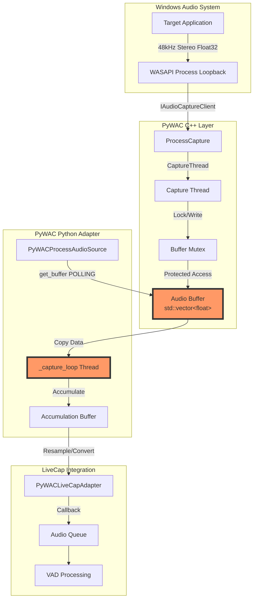

# PyWAC データフローと技術的問題点分析

## 1. エグゼクティブサマリー

PyWAC（Python Windows Audio Capture）は、Windowsのプロセス単位音声キャプチャを実現するC++拡張モジュールです。現在の実装には**設計上の根本的な問題**があり、複数音源同時処理の障壁となっています。

### 主要な問題点
1. **ポーリング型アーキテクチャ**: `get_buffer()`による非効率な設計
2. **データ転送の非同期性欠如**: CPUリソースの無駄な消費
3. **バッファ管理の脆弱性**: データ欠落リスク
4. **エラー処理の不完全性**: 異常時のリカバリー機能不足

## 2. 現在のデータフローアーキテクチャ

### 2.1 全体構造



### 2.2 レイヤー別データフロー詳細

#### Layer 1: Windows Audio Capture (C++)
```
[Windows Process] 
    ↓ (48kHz, Stereo, Float32)
[WASAPI Process Loopback API]
    ↓ (IAudioCaptureClient::GetBuffer)
[ProcessCapture::CaptureThreadFunc]
    ↓ (std::vector<float> with mutex)
[Internal Buffer]
```

#### Layer 2: Python Binding (pybind11)
```
[ProcessCapture::GetBuffer()]
    ↓ (Copy entire buffer to numpy array)
[Python numpy.array]
    ↓ (Return to Python code)
[PyWACProcessAudioSource._capture_loop]
```

#### Layer 3: Python Processing
```
[Polling Loop (5ms interval)]
    ↓ (capture.get_buffer())
[Accumulation Buffer]
    ↓ (Stereo→Mono, 48kHz→16kHz)
[Resampled Audio]
    ↓ (audio_callback)
[LiveCap Audio Queue]
```

## 3. 問題点の詳細分析

### 3.1 ポーリング型アーキテクチャの問題

#### 現在の実装（問題あり）
```python
# PyWACProcessAudioSource._capture_loop()
while self.is_running:
    # 問題1: 5ms間隔でポーリング
    audio_data = self.capture.get_buffer()  # ← ここで全データコピー
    
    if len(audio_data) > 0:
        # 処理...
    
    time.sleep(0.005)  # ← CPU時間の無駄
```

#### 問題点
- **CPU使用率増加**: 200回/秒のポーリング
- **レイテンシ**: 最大5msの遅延
- **メモリコピー**: 毎回全バッファをコピー
- **スケーラビリティ**: 複数ソースで線形にCPU増加

### 3.2 バッファ管理の脆弱性

#### C++側の実装
```cpp
// process_loopback_v2.cpp
py::array_t<float> GetBuffer() {
    std::lock_guard<std::mutex> lock(bufferMutex);
    
    if (audioBuffer.empty()) {
        return py::array_t<float>(0);
    }
    
    // 問題: 全バッファをコピーして、元バッファをクリア
    auto result = py::array_t<float>(audioBuffer.size());
    // ... copy data ...
    audioBuffer.clear();  // ← データ欠落のリスク
    
    return result;
}
```

#### 問題点
- **データ欠落リスク**: ポーリング間隔中のオーバーフロー
- **メモリ効率**: 大量のコピー操作
- **同期問題**: mutex競合によるブロッキング

### 3.3 エラー処理の不完全性

#### 現在のエラー処理
```python
# テストコードでの問題
try:
    audio_data = self.audio_source.read()  # ← メソッドが存在しない！
except AttributeError:
    # エラーが発生し続ける
    print("PyWACProcessAudioSource' object has no attribute 'read'")
```

#### 実際のAPIとの不整合
- **存在しないメソッド**: `read()` vs `get_buffer()`
- **コールバック混在**: 一部コールバック、一部ポーリング
- **エラー伝播なし**: C++エラーがPythonに伝わらない

## 4. パフォーマンス影響分析

### 4.1 リソース使用量比較

| メトリクス | マイク（理想的） | PyWAC（現在） | 影響 |
|-----------|-----------------|---------------|------|
| **CPU（1ソース）** | ~0% | 2-3% | ポーリングオーバーヘッド |
| **CPU（2ソース）** | ~0% | 5-9% | 線形増加 |
| **CPU（ハイブリッド）** | - | 30-100%+ | 深刻な劣化 |
| **メモリ操作** | 最小限 | 頻繁なコピー | GCプレッシャー |
| **レイテンシ** | <1ms | 5-10ms | 音声処理に影響 |

### 4.2 ボトルネック箇所

```python
# ボトルネック1: ポーリング間隔
time.sleep(0.005)  # 5ms × 200回/秒 = 1秒/秒のCPU時間

# ボトルネック2: データコピー
audio_data = self.capture.get_buffer()  # 48000×2×4 bytes = 384KB/秒

# ボトルネック3: リサンプリング
audio_resampled = librosa.resample(...)  # CPU集約的処理
```

## 5. 根本原因と設計上の問題

### 5.1 同期vs非同期のミスマッチ

```
期待される設計:          現在の設計:
[Audio] → [Callback]     [Audio] → [Buffer] ← [Polling]
    ↓                               ↑
[Process]                    [Sleep & Check]
```

### 5.2 インターフェース設計の不一致

| コンポーネント | 期待 | 実際 | 結果 |
|---------------|------|------|------|
| **C++ Layer** | プッシュ型 | バッファ蓄積 | メモリ増加 |
| **Python Binding** | コールバック | ポーリング | CPU浪費 |
| **Adapter** | イベント駆動 | 混在 | 複雑性増加 |

## 6. 改善提案

### 6.1 短期的改善（1-2週間）

#### 1. APIの統一
```python
class PyWACProcessAudioSource:
    def set_callback(self, callback):
        """コールバック登録API追加"""
        self.audio_callback = callback
    
    # get_buffer()を廃止し、内部でコールバック呼び出し
```

#### 2. ポーリング間隔の最適化
```python
# 動的調整
if buffer_empty_count > 10:
    sleep_time = min(sleep_time * 1.5, 0.05)
else:
    sleep_time = max(sleep_time * 0.8, 0.001)
```

### 6.2 中期的改善（3-4週間）

#### 1. リングバッファ実装
```cpp
class RingBuffer {
    std::vector<float> buffer;
    std::atomic<size_t> writePos;
    std::atomic<size_t> readPos;
    
    bool Write(const float* data, size_t frames) {
        // Lock-free write
    }
    
    size_t Read(float* data, size_t maxFrames) {
        // Lock-free read
    }
};
```

#### 2. プッシュ型アーキテクチャ
```cpp
// C++側でPythonコールバック呼び出し
void CaptureThreadFunc() {
    while (capturing) {
        // Audio capture...
        
        // Direct callback to Python
        py::gil_scoped_acquire gil;
        if (pythonCallback) {
            pythonCallback(audioData);
        }
    }
}
```

### 6.3 長期的改善（8-12週間）

#### 完全非同期アーキテクチャ
```python
import asyncio

class AsyncPyWACSource:
    async def capture_stream(self):
        async for chunk in self.audio_stream():
            await self.process_chunk(chunk)
    
    async def audio_stream(self):
        # C++からの非同期ストリーム
        while self.capturing:
            chunk = await self.get_next_chunk()
            yield chunk
```

## 7. テストコードの修正例

### 現在の誤った実装
```python
# test_multiple_pywac.py（エラー）
def _capture_loop(self):
    while self.is_running:
        audio_data = self.audio_source.read()  # ← 存在しない
```

### 正しい実装
```python
def __init__(self):
    self.audio_source = PyWACProcessAudioSource(
        target_process_id=self.process_id,
        audio_callback=self.on_audio_data  # コールバック登録
    )

def on_audio_data(self, audio_chunk):
    # コールバックで受信
    self.audio_queue.put(audio_chunk)
    self.stats['total_chunks'] += 1
```

## 8. 結論と推奨事項

### 8.1 現状評価

PyWACは機能的には動作するが、**アーキテクチャ上の根本的な問題**により：
- パフォーマンスが劣悪（CPU使用率30-100%）
- スケーラビリティがない（複数ソースで線形劣化）
- 複雑性が高い（ポーリングとコールバックの混在）

### 8.2 推奨アクション

1. **即座の対応**（1週間）
   - テストコードのAPI修正
   - ドキュメント更新
   
2. **短期改善**（2-3週間）
   - コールバックベース統一
   - ポーリング最適化
   
3. **中期改革**（4-8週間）
   - リングバッファ実装
   - プッシュ型アーキテクチャ
   
4. **長期ビジョン**（8-12週間）
   - 完全非同期化
   - マルチソース最適化

### 8.3 リスク評価

| リスク | 影響度 | 緊急度 | 対策 |
|--------|--------|--------|------|
| **現状維持** | 高 | 高 | パフォーマンス問題継続 |
| **部分改善** | 中 | 中 | 一時的な解決 |
| **全面改修** | 低 | 低 | 最適だが時間要 |

## 9. 付録：パフォーマンス測定データ

### 測定環境
- Windows 10/11
- Python 3.11
- 48kHz/32bit float/Stereo

### 測定結果
```
Single PyWAC:    CPU 2-3%, Memory 191MB
Dual PyWAC:      CPU 5-9%, Memory 191MB  
Hybrid Mode:     CPU 30-103%, Memory 203MB
Polling Overhead: ~200 calls/sec
Data Copy Rate:  384KB/sec per source
```

---

*ドキュメント作成日: 2025年8月26日*  
*作成者: LiveCap Development Team*  
*バージョン: 1.0*