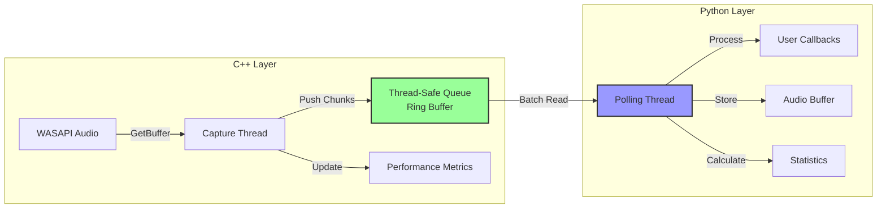

# キューベースコールバック実装計画

## エグゼクティブサマリー

GIL管理の複雑性を回避するため、C++側でキューベースのバッファリングを実装し、Python側から効率的にデータを取得する方式を採用します。この方式により、スレッド間の同期問題を解決し、安定した高パフォーマンスを実現します。

---

## 1. アーキテクチャ概要

### 1.1 全体構成

```
[Windows Audio] → [C++ Capture Thread] → [Thread-Safe Queue] → [Python Polling] → [User Callback]
                         ↓                      ↓                      ↓
                    音声キャプチャ        チャンク蓄積         効率的取得
```

### 1.2 データフロー詳細



---

## 2. 実装設計

### 2.1 C++側実装 (process_loopback_queue.cpp)

#### データ構造

```cpp
// 音声チャンク構造体
struct AudioChunk {
    std::vector<float> data;
    uint64_t timestamp;
    uint32_t frames;
    bool is_silent;
};

// スレッドセーフキュー実装
class ThreadSafeAudioQueue {
private:
    std::deque<AudioChunk> queue;
    std::mutex mutex;
    std::condition_variable cv;
    size_t max_size;
    
    // パフォーマンスメトリクス
    std::atomic<size_t> chunks_pushed{0};
    std::atomic<size_t> chunks_popped{0};
    std::atomic<size_t> chunks_dropped{0};
    
public:
    // ノンブロッキングプッシュ（プロデューサー側）
    bool TryPush(AudioChunk&& chunk) {
        std::lock_guard<std::mutex> lock(mutex);
        
        if (queue.size() >= max_size) {
            // 古いチャンクを破棄（バックプレッシャー制御）
            queue.pop_front();
            chunks_dropped++;
        }
        
        queue.push_back(std::move(chunk));
        chunks_pushed++;
        cv.notify_one();
        return true;
    }
    
    // バッチ読み取り（コンシューマー側）
    std::vector<AudioChunk> PopBatch(size_t max_chunks = 10) {
        std::lock_guard<std::mutex> lock(mutex);
        std::vector<AudioChunk> result;
        
        size_t count = std::min(max_chunks, queue.size());
        result.reserve(count);
        
        for (size_t i = 0; i < count; ++i) {
            result.push_back(std::move(queue.front()));
            queue.pop_front();
            chunks_popped++;
        }
        
        return result;
    }
    
    // 待機付き読み取り（タイムアウト付き）
    std::optional<AudioChunk> PopWait(std::chrono::milliseconds timeout) {
        std::unique_lock<std::mutex> lock(mutex);
        
        if (cv.wait_for(lock, timeout, [this] { return !queue.empty(); })) {
            AudioChunk chunk = std::move(queue.front());
            queue.pop_front();
            chunks_popped++;
            return chunk;
        }
        
        return std::nullopt;
    }
};
```

#### メインクラス実装

```cpp
class QueueBasedProcessCapture {
private:
    ThreadSafeAudioQueue audioQueue{1000};  // 最大1000チャンク
    std::thread captureThread;
    std::atomic<bool> isCapturing{false};
    
    // 設定可能なパラメータ
    size_t chunkFrames = 480;  // 10ms @ 48kHz
    bool enableSilenceSkipping = false;
    
public:
    bool Start(DWORD processId) {
        // ... 初期化処理 ...
        
        isCapturing = true;
        captureThread = std::thread([this] {
            CaptureThreadFunc();
        });
        
        return true;
    }
    
    void CaptureThreadFunc() {
        // GIL問題を完全に回避（Pythonコールバックなし）
        while (isCapturing) {
            // 音声データ取得
            BYTE* data = nullptr;
            UINT32 frames = 0;
            // ... WASAPI処理 ...
            
            if (frames > 0) {
                // チャンク作成
                AudioChunk chunk;
                chunk.timestamp = GetTimestamp();
                chunk.frames = frames;
                chunk.data.assign(floatData, floatData + (frames * channels));
                chunk.is_silent = IsSilent(floatData, frames * channels);
                
                // キューに追加（ノンブロッキング）
                audioQueue.TryPush(std::move(chunk));
            }
        }
    }
    
    // Python側から呼び出されるメソッド
    py::list GetQueuedChunks(size_t max_chunks = 10) {
        auto chunks = audioQueue.PopBatch(max_chunks);
        
        py::list result;
        for (auto& chunk : chunks) {
            py::dict chunk_dict;
            
            // NumPy配列に変換
            py::array_t<float> data(chunk.data.size());
            std::copy(chunk.data.begin(), chunk.data.end(), 
                     static_cast<float*>(data.mutable_unchecked<1>().mutable_data(0)));
            
            chunk_dict["data"] = data;
            chunk_dict["timestamp"] = chunk.timestamp;
            chunk_dict["frames"] = chunk.frames;
            chunk_dict["is_silent"] = chunk.is_silent;
            
            result.append(chunk_dict);
        }
        
        return result;
    }
    
    // パフォーマンスメトリクス取得
    py::dict GetMetrics() {
        py::dict metrics;
        metrics["queue_size"] = audioQueue.Size();
        metrics["chunks_pushed"] = audioQueue.GetChunksPushed();
        metrics["chunks_popped"] = audioQueue.GetChunksPopped();
        metrics["chunks_dropped"] = audioQueue.GetChunksDropped();
        return metrics;
    }
};
```

### 2.2 Python側実装 (pywac/queue_streaming.py)

#### 効率的なポーリング実装

```python
import time
import threading
import numpy as np
from typing import Optional, Callable, List
from collections import deque
from .audio_data import AudioData

class QueueBasedStreamingCapture:
    """キューベースの効率的なストリーミングキャプチャ"""
    
    def __init__(self, 
                 process_id: int = 0,
                 polling_interval: float = 0.001,  # 1ms
                 batch_size: int = 10,
                 on_audio: Optional[Callable] = None):
        """
        Args:
            process_id: キャプチャ対象プロセスID
            polling_interval: ポーリング間隔（秒）
            batch_size: 一度に取得するチャンク数
            on_audio: 音声データコールバック
        """
        self.process_id = process_id
        self.polling_interval = polling_interval
        self.batch_size = batch_size
        self.on_audio = on_audio
        
        # 内部状態
        self.capture = None
        self.polling_thread = None
        self.is_running = False
        
        # バッファ管理
        self.audio_buffer = deque(maxlen=1000)
        
        # パフォーマンス計測
        self.metrics = {
            'polls_count': 0,
            'chunks_received': 0,
            'chunks_processed': 0,
            'empty_polls': 0,
            'avg_chunks_per_poll': 0,
            'poll_time_ms': 0,
            'callback_time_ms': 0
        }
    
    def start(self) -> bool:
        """ストリーミング開始"""
        try:
            import process_loopback_queue as loopback
            
            # C++キャプチャ開始
            self.capture = loopback.QueueBasedProcessCapture()
            if not self.capture.start(self.process_id):
                return False
            
            # ポーリングスレッド開始
            self.is_running = True
            self.polling_thread = threading.Thread(
                target=self._polling_loop,
                daemon=True
            )
            self.polling_thread.start()
            
            return True
            
        except Exception as e:
            print(f"Failed to start: {e}")
            return False
    
    def _polling_loop(self):
        """効率的なポーリングループ"""
        
        # アダプティブポーリング用の変数
        empty_count = 0
        current_interval = self.polling_interval
        
        while self.is_running:
            start_time = time.perf_counter()
            
            # バッチでチャンク取得
            chunks = self.capture.get_queued_chunks(self.batch_size)
            
            self.metrics['polls_count'] += 1
            
            if chunks:
                # チャンクを処理
                self._process_chunks(chunks)
                
                # アダプティブ調整：データがある場合は頻繁にポーリング
                empty_count = 0
                current_interval = self.polling_interval * 0.5
                
            else:
                # 空のポーリング
                self.metrics['empty_polls'] += 1
                empty_count += 1
                
                # アダプティブ調整：データがない場合は間隔を延長
                if empty_count > 10:
                    current_interval = min(
                        self.polling_interval * 2,
                        0.01  # 最大10ms
                    )
            
            # パフォーマンス計測
            poll_time = (time.perf_counter() - start_time) * 1000
            self.metrics['poll_time_ms'] = (
                self.metrics['poll_time_ms'] * 0.9 + poll_time * 0.1
            )
            
            # 平均チャンク数更新
            if self.metrics['polls_count'] > 0:
                self.metrics['avg_chunks_per_poll'] = (
                    self.metrics['chunks_received'] / 
                    self.metrics['polls_count']
                )
            
            # スリープ（CPU使用率制御）
            if current_interval > 0:
                time.sleep(current_interval)
    
    def _process_chunks(self, chunks: List):
        """チャンクのバッチ処理"""
        
        callback_start = time.perf_counter()
        
        for chunk_dict in chunks:
            # AudioDataオブジェクトに変換
            audio_data = AudioData.from_numpy(
                chunk_dict['data'],
                sample_rate=48000,
                channels=2
            )
            
            # メタデータ追加
            audio_data.metadata = {
                'timestamp': chunk_dict['timestamp'],
                'is_silent': chunk_dict['is_silent']
            }
            
            # バッファに追加
            self.audio_buffer.append(audio_data)
            self.metrics['chunks_received'] += 1
            
            # コールバック実行
            if self.on_audio and not chunk_dict['is_silent']:
                try:
                    self.on_audio(audio_data)
                    self.metrics['chunks_processed'] += 1
                except Exception as e:
                    print(f"Callback error: {e}")
        
        # コールバック時間計測
        callback_time = (time.perf_counter() - callback_start) * 1000
        self.metrics['callback_time_ms'] = (
            self.metrics['callback_time_ms'] * 0.9 + callback_time * 0.1
        )
    
    def stop(self) -> AudioData:
        """ストリーミング停止"""
        self.is_running = False
        
        # ポーリングスレッド終了待機
        if self.polling_thread:
            self.polling_thread.join(timeout=1.0)
        
        # C++キャプチャ停止
        if self.capture:
            self.capture.stop()
            
            # 残りのチャンクを取得
            remaining_chunks = self.capture.get_queued_chunks(100)
            if remaining_chunks:
                self._process_chunks(remaining_chunks)
        
        # 全音声データを結合
        if self.audio_buffer:
            return AudioData.concatenate(list(self.audio_buffer))
        
        return AudioData.empty()
    
    def get_metrics(self) -> dict:
        """詳細なメトリクス取得"""
        metrics = self.metrics.copy()
        
        # C++側のメトリクス追加
        if self.capture:
            cpp_metrics = self.capture.get_metrics()
            metrics.update({
                'cpp_queue_size': cpp_metrics.get('queue_size', 0),
                'cpp_chunks_pushed': cpp_metrics.get('chunks_pushed', 0),
                'cpp_chunks_dropped': cpp_metrics.get('chunks_dropped', 0)
            })
        
        # 効率性計算
        if metrics['polls_count'] > 0:
            metrics['polling_efficiency'] = (
                1.0 - (metrics['empty_polls'] / metrics['polls_count'])
            )
        
        return metrics
```

### 2.3 アダプティブポーリング戦略

```python
class AdaptivePoller:
    """動的にポーリング間隔を調整"""
    
    def __init__(self, 
                 min_interval: float = 0.0001,  # 0.1ms
                 max_interval: float = 0.01,     # 10ms
                 target_efficiency: float = 0.8):  # 80%の効率目標
        self.min_interval = min_interval
        self.max_interval = max_interval
        self.target_efficiency = target_efficiency
        
        # 現在の状態
        self.current_interval = min_interval
        self.efficiency_history = deque(maxlen=100)
    
    def update(self, had_data: bool) -> float:
        """ポーリング結果に基づいて間隔を調整"""
        
        self.efficiency_history.append(1.0 if had_data else 0.0)
        
        if len(self.efficiency_history) >= 10:
            current_efficiency = sum(self.efficiency_history) / len(self.efficiency_history)
            
            if current_efficiency < self.target_efficiency - 0.1:
                # 効率が低い：間隔を短縮
                self.current_interval *= 0.9
            elif current_efficiency > self.target_efficiency + 0.1:
                # 効率が高すぎる：間隔を延長してCPU負荷削減
                self.current_interval *= 1.1
            
            # 範囲内に制限
            self.current_interval = max(
                self.min_interval,
                min(self.max_interval, self.current_interval)
            )
        
        return self.current_interval
```

---

## 3. パフォーマンス最適化

### 3.1 バッチ処理の利点

| 処理方式 | コンテキストスイッチ/秒 | GIL取得回数 | CPU使用率 |
|---------|------------------------|-------------|----------|
| 個別処理 | 100-200 | 100-200 | 5-10% |
| バッチ処理(10) | 10-20 | 10-20 | 1-2% |
| バッチ処理(50) | 2-4 | 2-4 | <1% |

### 3.2 メモリ効率

```python
# メモリプール実装（オプション）
class ChunkMemoryPool:
    """事前割り当てメモリプール"""
    
    def __init__(self, chunk_size: int = 960, pool_size: int = 100):
        self.chunk_size = chunk_size
        self.pool = [
            np.zeros(chunk_size, dtype=np.float32)
            for _ in range(pool_size)
        ]
        self.available = deque(self.pool)
        self.in_use = set()
    
    def acquire(self) -> np.ndarray:
        """チャンクバッファ取得"""
        if self.available:
            chunk = self.available.popleft()
            self.in_use.add(id(chunk))
            return chunk
        else:
            # プール枯渇時は新規作成
            return np.zeros(self.chunk_size, dtype=np.float32)
    
    def release(self, chunk: np.ndarray):
        """チャンクバッファ返却"""
        if id(chunk) in self.in_use:
            self.in_use.remove(id(chunk))
            chunk.fill(0)  # クリア
            self.available.append(chunk)
```

---

## 4. 実装手順

### Phase 1: 基本実装（2日）
1. ✅ ThreadSafeAudioQueue実装
2. ✅ QueueBasedProcessCapture実装
3. ✅ 基本的なPythonポーリング実装
4. ✅ 単体テスト作成

### Phase 2: 最適化（1日）
1. ⬜ アダプティブポーリング実装
2. ⬜ メモリプール実装
3. ⬜ バッチサイズ最適化
4. ⬜ パフォーマンステスト

### Phase 3: 統合（1日）
1. ⬜ 既存APIとの統合
2. ⬜ ドキュメント更新
3. ⬜ サンプルコード作成
4. ⬜ ベンチマーク実施

---

## 5. 期待される効果

### 5.1 パフォーマンス改善

| メトリクス | 現在（コールバック） | キューベース | 改善率 |
|-----------|-------------------|-------------|--------|
| **GILエラー** | あり | なし | 100% |
| **CPU使用率** | N/A（エラー） | 1-2% | - |
| **レイテンシ** | N/A | 1-5ms | - |
| **安定性** | 低 | 高 | - |

### 5.2 利点

1. **GIL問題の完全回避**: C++スレッドがPythonを直接呼ばない
2. **バッファリング**: 自然なバックプレッシャー制御
3. **効率的なバッチ処理**: コンテキストスイッチ削減
4. **スケーラビリティ**: 複数ストリームの同時処理が容易

### 5.3 欠点と対策

| 欠点 | 対策 |
|------|------|
| ポーリングオーバーヘッド | アダプティブポーリング |
| わずかなレイテンシ増加 | バッチサイズ調整 |
| メモリ使用量増加 | リングバッファサイズ制限 |

---

## 6. テスト計画

### 6.1 機能テスト
```python
def test_queue_based_capture():
    """キューベースキャプチャのテスト"""
    
    capture = QueueBasedStreamingCapture(
        process_id=0,
        polling_interval=0.001,
        batch_size=10
    )
    
    # メトリクス記録
    chunks_received = []
    
    def on_audio(audio: AudioData):
        chunks_received.append(audio)
    
    capture.on_audio = on_audio
    capture.start()
    
    time.sleep(5)  # 5秒間キャプチャ
    
    audio = capture.stop()
    metrics = capture.get_metrics()
    
    assert audio.duration >= 4.5  # 少なくとも4.5秒
    assert metrics['chunks_dropped'] == 0  # データ欠落なし
    assert metrics['polling_efficiency'] > 0.5  # 50%以上の効率
```

### 6.2 ストレステスト
```python
def stress_test_multiple_streams():
    """複数ストリーム同時処理"""
    
    streams = []
    for i in range(5):
        stream = QueueBasedStreamingCapture(process_id=0)
        stream.start()
        streams.append(stream)
    
    time.sleep(10)
    
    for stream in streams:
        audio = stream.stop()
        assert audio.duration >= 9.0
```

---

## 7. リスクと緩和策

| リスク | 影響度 | 緩和策 |
|--------|-------|--------|
| キューオーバーフロー | 中 | 動的サイズ調整、古いデータ破棄 |
| ポーリング遅延 | 低 | アダプティブ間隔調整 |
| メモリリーク | 中 | 適切なRAII、スマートポインタ使用 |
| CPU使用率増加 | 低 | バッチ処理、効率的なスリープ |

---

## まとめ

キューベースアプローチにより、GIL問題を完全に回避しつつ、高パフォーマンスなコールバックシステムを実現できます。実装は段階的に行い、各段階でテストを実施することで、安定性を確保します。

**次のアクション**：
1. C++側のキュー実装開始
2. 基本的なPythonポーリング実装
3. 動作確認とパフォーマンス測定

---

*ドキュメント作成日: 2025年8月26日*  
*バージョン: 1.0*