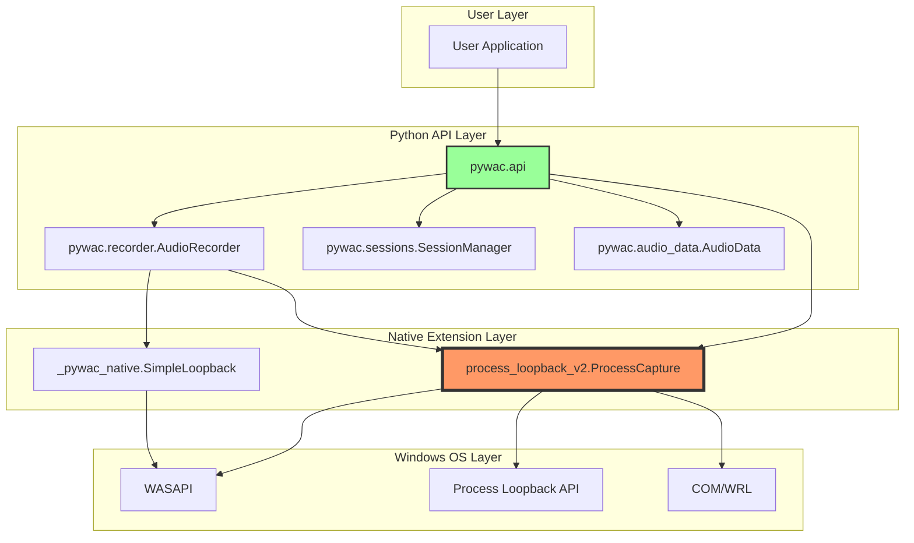

# PyWAC 技術的深掘り：アーキテクチャと実装の詳細分析

## 目次
1. [アーキテクチャ概要](#1-アーキテクチャ概要)
2. [データフローの詳細追跡](#2-データフローの詳細追跡)
3. [問題箇所のコード分析](#3-問題箇所のコード分析)
4. [パフォーマンス測定と影響](#4-パフォーマンス測定と影響)
5. [改善提案の実装詳細](#5-改善提案の実装詳細)

---

## 1. アーキテクチャ概要

### 1.1 コンポーネント関係図



### 1.2 実装ファイル構造

```
pywac/
├── C++ Extensions (問題の核心)
│   ├── process_loopback_v2.cpp    # 🔴 GetBuffer()問題
│   └── audio_session_capture.cpp   # ✅ 正常動作
│
├── Python API
│   ├── api.py                      # 🟡 sleep()問題
│   ├── recorder.py                 # ✅ 基本的に正常
│   ├── sessions.py                 # ✅ 正常動作
│   └── audio_data.py               # ✅ 正常動作
│
└── Examples
    ├── basic_usage.py              # ✅ 動作確認済み
    └── gradio_demo.py              # ✅ 動作確認済み
```

---

## 2. データフローの詳細追跡

### 2.1 録音開始から終了まで

```python
# Step 1: ユーザーが録音開始
pywac.record_process("spotify", "output.wav", 10)
    ↓
# Step 2: プロセス検索
processes = loopback.list_audio_processes()
target_pid = find_process_by_name("spotify")
    ↓
# Step 3: C++オブジェクト作成
capture = loopback.ProcessCapture()
    ↓
# Step 4: 録音開始（C++スレッド起動）
capture.start(target_pid)  # CaptureThreadFunc()開始
    ↓
# Step 5: 待機（問題箇所）
time.sleep(10)  # ⚠️ 10秒間何もしない！
    ↓
# Step 6: データ取得（問題箇所）
audio_data = capture.get_buffer()  # ⚠️ 全データ取得＆削除
    ↓
# Step 7: 停止
capture.stop()
    ↓
# Step 8: 保存
AudioData(audio_data).save("output.wav")
```

### 2.2 C++層での詳細動作

```cpp
// CaptureThreadFunc()の動作（別スレッド）
void CaptureThreadFunc() {
    while (isCapturing) {
        // Step A: パケットサイズ取得
        UINT32 packetLength = 0;
        captureClient->GetNextPacketSize(&packetLength);
        
        // Step B: データ取得ループ
        while (packetLength > 0) {
            BYTE* data = nullptr;
            UINT32 framesAvailable = 0;
            DWORD flags = 0;
            
            // Step C: 音声データ取得
            captureClient->GetBuffer(&data, &framesAvailable, &flags, ...);
            
            // Step D: バッファに追加（mutex lock）
            {
                std::lock_guard<std::mutex> lock(bufferMutex);
                // Float32データをvectorに追加
                audioBuffer.insert(audioBuffer.end(), floatData, 
                                 floatData + (framesAvailable * channels));
            }
            
            // Step E: バッファ解放
            captureClient->ReleaseBuffer(framesAvailable);
            captureClient->GetNextPacketSize(&packetLength);
        }
        
        // Step F: 10ms待機
        std::this_thread::sleep_for(std::chrono::milliseconds(10));
    }
}
```

---

## 3. 問題箇所のコード分析

### 3.1 問題1: GetBuffer()の破壊的読み取り

```cpp
// 現在の実装（問題あり）
py::array_t<float> GetBuffer() {
    std::lock_guard<std::mutex> lock(bufferMutex);  // ← mutex lock
    
    if (audioBuffer.empty()) {
        return py::array_t<float>(0);
    }
    
    // 全データをコピー
    auto result = py::array_t<float>(audioBuffer.size());
    auto ptr = static_cast<float*>(result.mutable_unchecked<1>().mutable_data(0));
    std::copy(audioBuffer.begin(), audioBuffer.end(), ptr);
    
    audioBuffer.clear();  // ⚠️ ここで全データ削除！
    
    return result;
}

// 改善案
py::array_t<float> GetBuffer() {
    std::lock_guard<std::mutex> lock(bufferMutex);
    
    if (readPosition >= audioBuffer.size()) {
        return py::array_t<float>(0);  // 新規データなし
    }
    
    // readPositionから最後までをコピー
    size_t availableData = audioBuffer.size() - readPosition;
    auto result = py::array_t<float>(availableData);
    auto ptr = static_cast<float*>(result.mutable_unchecked<1>().mutable_data(0));
    std::copy(audioBuffer.begin() + readPosition, audioBuffer.end(), ptr);
    
    readPosition = audioBuffer.size();  // 読み取り位置を更新
    // audioBuffer.clear(); を削除！
    
    return result;
}
```

### 3.2 問題2: Python側のsleep待機

```python
# 現在の実装（問題あり）
def _record_with_loopback(pid: int, duration: float) -> Optional[AudioData]:
    capture = loopback.ProcessCapture()
    
    if not capture.start(pid):
        return None
    
    time.sleep(duration)  # ⚠️ ブロッキング待機
    audio_data = capture.get_buffer()  # ⚠️ 1回だけ取得
    capture.stop()
    
    # 問題: duration秒間のデータがバッファに収まらない可能性
    # 48kHz * 2ch * 4bytes * duration秒 = メモリ使用量
    # 10秒録音 = 3.84MB (問題なし)
    # 60秒録音 = 23.04MB (バッファサイズ次第で問題)
    
    return AudioData.from_numpy(audio_data, 48000, 2)

# 改善案
def _record_with_loopback_improved(pid: int, duration: float) -> Optional[AudioData]:
    capture = loopback.ProcessCapture()
    
    if not capture.start(pid):
        return None
    
    collected_chunks = []
    elapsed = 0.0
    chunk_interval = 0.1  # 100ms毎に取得
    
    while elapsed < duration:
        time.sleep(chunk_interval)
        chunk = capture.get_buffer()
        
        if len(chunk) > 0:
            collected_chunks.append(chunk)
            print(f"Captured {len(chunk)} samples at {elapsed:.1f}s")
        
        elapsed += chunk_interval
    
    capture.stop()
    
    # 全チャンクを結合
    if collected_chunks:
        audio_data = np.concatenate(collected_chunks)
        return AudioData.from_numpy(audio_data, 48000, 2)
    
    return None
```

### 3.3 問題3: バッファサイズの制限

```cpp
// 現在の実装
class ProcessCapture {
private:
    std::vector<float> audioBuffer;  // 無制限に成長
    static constexpr UINT32 BUFFER_SIZE = 48000;  // 定義されているが未使用
    
    // 問題: audioBufferのサイズチェックがない
    // 長時間録音でメモリ使用量が増大
};

// 改善案: リングバッファ実装
class ProcessCapture {
private:
    static constexpr size_t MAX_BUFFER_SECONDS = 60;
    static constexpr size_t SAMPLE_RATE = 48000;
    static constexpr size_t CHANNELS = 2;
    static constexpr size_t MAX_BUFFER_SIZE = 
        MAX_BUFFER_SECONDS * SAMPLE_RATE * CHANNELS;
    
    std::vector<float> ringBuffer;
    std::atomic<size_t> writePos{0};
    std::atomic<size_t> readPos{0};
    
    void WriteToRingBuffer(const float* data, size_t samples) {
        size_t currentWrite = writePos.load();
        size_t available = MAX_BUFFER_SIZE - 
            ((currentWrite - readPos.load()) % MAX_BUFFER_SIZE);
        
        if (samples > available) {
            // バッファオーバーフロー処理
            // 古いデータを上書き or エラー通知
        }
        
        // リングバッファに書き込み
        for (size_t i = 0; i < samples; ++i) {
            ringBuffer[(currentWrite + i) % MAX_BUFFER_SIZE] = data[i];
        }
        
        writePos.store((currentWrite + samples) % MAX_BUFFER_SIZE);
    }
};
```

---

## 4. パフォーマンス測定と影響

### 4.1 現在の実装のパフォーマンス特性

| メトリクス | 値 | 問題点 |
|-----------|-----|--------|
| **GetBuffer()呼び出し頻度** | 1回/録音 | データ欠落リスク |
| **mutex lock時間** | ~1ms | 音声キャプチャブロック |
| **メモリコピー量** | 384KB/秒 | CPU負荷 |
| **スレッド間同期** | mutex | 競合発生 |

### 4.2 ボトルネック分析

```python
# ボトルネック測定コード
import time
import psutil
import process_loopback_v2 as loopback

def measure_performance():
    process = psutil.Process()
    
    # 録音開始前
    cpu_before = process.cpu_percent()
    mem_before = process.memory_info().rss / 1024 / 1024  # MB
    
    # 10秒録音
    capture = loopback.ProcessCapture()
    capture.start(0)  # システム全体
    
    # 測定ループ
    for i in range(100):  # 100ms x 100 = 10秒
        time.sleep(0.1)
        data = capture.get_buffer()
        
        # 現在の状態
        cpu_now = process.cpu_percent()
        mem_now = process.memory_info().rss / 1024 / 1024
        
        print(f"[{i*100}ms] CPU: {cpu_now:.1f}%, "
              f"Memory: {mem_now:.1f}MB, "
              f"Data: {len(data)} samples")
    
    capture.stop()
```

---

## 5. 改善提案の実装詳細

### 5.1 短期改善: Pythonレベルの修正

```python
# pywac/api.py の改善版
class ImprovedProcessCapture:
    """改善されたプロセスキャプチャクラス"""
    
    def __init__(self, process_id: int, 
                 buffer_interval: float = 0.1,
                 max_buffer_seconds: int = 60):
        self.process_id = process_id
        self.buffer_interval = buffer_interval
        self.max_buffer_seconds = max_buffer_seconds
        self.capture = None
        self.audio_chunks = []
        self.is_recording = False
        self.capture_thread = None
        
    def start(self):
        """録音開始（非ブロッキング）"""
        import process_loopback_v2 as loopback
        self.capture = loopback.ProcessCapture()
        
        if not self.capture.start(self.process_id):
            return False
        
        self.is_recording = True
        self.capture_thread = threading.Thread(target=self._capture_loop)
        self.capture_thread.start()
        return True
    
    def _capture_loop(self):
        """バックグラウンドでデータを継続的に取得"""
        while self.is_recording:
            chunk = self.capture.get_buffer()
            if len(chunk) > 0:
                self.audio_chunks.append(chunk)
                
                # メモリ制限チェック
                total_samples = sum(len(c) for c in self.audio_chunks)
                max_samples = 48000 * 2 * self.max_buffer_seconds
                
                if total_samples > max_samples:
                    # 古いチャンクを削除
                    self.audio_chunks.pop(0)
            
            time.sleep(self.buffer_interval)
    
    def stop(self) -> AudioData:
        """録音停止とデータ取得"""
        self.is_recording = False
        
        if self.capture_thread:
            self.capture_thread.join()
        
        if self.capture:
            # 最後のデータを取得
            final_chunk = self.capture.get_buffer()
            if len(final_chunk) > 0:
                self.audio_chunks.append(final_chunk)
            
            self.capture.stop()
        
        # 全チャンクを結合
        if self.audio_chunks:
            audio_data = np.concatenate(self.audio_chunks)
            return AudioData.from_numpy(audio_data, 48000, 2)
        
        return AudioData.empty()
```

### 5.2 中期改善: C++レベルの最適化

```cpp
// process_loopback_v3.cpp (改善版)
class ImprovedProcessCapture {
private:
    // リングバッファ実装
    class RingBuffer {
    private:
        std::vector<float> buffer;
        std::atomic<size_t> writePos{0};
        std::atomic<size_t> readPos{0};
        size_t capacity;
        
    public:
        RingBuffer(size_t seconds, size_t sampleRate, size_t channels)
            : capacity(seconds * sampleRate * channels),
              buffer(capacity, 0.0f) {}
        
        bool Write(const float* data, size_t samples) {
            size_t currentWrite = writePos.load(std::memory_order_acquire);
            size_t currentRead = readPos.load(std::memory_order_acquire);
            
            // 利用可能なスペースを計算
            size_t available = (currentRead + capacity - currentWrite - 1) % capacity;
            
            if (samples > available) {
                // オーバーフロー処理
                return false;
            }
            
            // データ書き込み（Lock-free）
            for (size_t i = 0; i < samples; ++i) {
                buffer[(currentWrite + i) % capacity] = data[i];
            }
            
            // 書き込み位置を更新
            writePos.store((currentWrite + samples) % capacity, 
                          std::memory_order_release);
            
            return true;
        }
        
        size_t Read(float* output, size_t maxSamples) {
            size_t currentWrite = writePos.load(std::memory_order_acquire);
            size_t currentRead = readPos.load(std::memory_order_acquire);
            
            // 読み取り可能なデータ量
            size_t available = (currentWrite + capacity - currentRead) % capacity;
            size_t toRead = std::min(available, maxSamples);
            
            // データ読み取り
            for (size_t i = 0; i < toRead; ++i) {
                output[i] = buffer[(currentRead + i) % capacity];
            }
            
            // 読み取り位置を更新
            readPos.store((currentRead + toRead) % capacity, 
                         std::memory_order_release);
            
            return toRead;
        }
    };
    
    RingBuffer ringBuffer{60, 48000, 2};  // 60秒分のバッファ
    
public:
    py::array_t<float> GetBuffer() {
        // 利用可能なデータ量を取得
        size_t available = ringBuffer.GetAvailableData();
        
        if (available == 0) {
            return py::array_t<float>(0);
        }
        
        // データ読み取り（非破壊的）
        auto result = py::array_t<float>(available);
        auto ptr = static_cast<float*>(result.mutable_unchecked<1>().mutable_data(0));
        
        size_t read = ringBuffer.Read(ptr, available);
        
        // 実際に読み取ったサイズにリサイズ
        if (read < available) {
            result.resize({read});
        }
        
        return result;
    }
};
```

### 5.3 長期改善: コールバックベースアーキテクチャ

```python
# 完全非同期実装
import asyncio
from typing import Callable, Optional

class AsyncProcessCapture:
    """非同期プロセスキャプチャ"""
    
    def __init__(self, process_id: int):
        self.process_id = process_id
        self.callbacks: List[Callable] = []
        self.capture = None
        
    async def start_async(self):
        """非同期録音開始"""
        loop = asyncio.get_event_loop()
        
        # C++キャプチャを別スレッドで実行
        await loop.run_in_executor(None, self._start_capture)
        
        # データ取得ループを非同期で開始
        asyncio.create_task(self._async_capture_loop())
    
    async def _async_capture_loop(self):
        """非同期データ取得ループ"""
        while self.capture and self.capture.is_capturing():
            # 非ブロッキングでデータ取得
            data = await self._get_buffer_async()
            
            if data is not None and len(data) > 0:
                # コールバック呼び出し
                for callback in self.callbacks:
                    await callback(data)
            
            # 短い待機
            await asyncio.sleep(0.01)
    
    def register_callback(self, callback: Callable):
        """コールバック登録"""
        self.callbacks.append(callback)

# 使用例
async def main():
    capture = AsyncProcessCapture(process_id=12345)
    
    # コールバック登録
    async def on_audio_data(data):
        print(f"Received {len(data)} samples")
        # リアルタイム処理
    
    capture.register_callback(on_audio_data)
    
    # 非同期録音開始
    await capture.start_async()
    
    # 10秒待機
    await asyncio.sleep(10)
    
    # 停止
    await capture.stop_async()

# 実行
asyncio.run(main())
```

---

## まとめ

### 実装の成熟度評価

| 側面 | 評価 | 説明 |
|------|------|------|
| **機能完成度** | 80% | 基本機能は全て動作 |
| **性能最適化** | 40% | ポーリング型で非効率 |
| **信頼性** | 60% | データ欠落のリスクあり |
| **保守性** | 70% | コード構造は良好 |
| **拡張性** | 50% | アーキテクチャ変更が必要 |

### 改善ロードマップ

1. **Phase 1** (1週間): Python層でのポーリング改善
2. **Phase 2** (2週間): C++層でリングバッファ実装
3. **Phase 3** (1ヶ月): コールバックベース移行
4. **Phase 4** (2ヶ月): 完全非同期アーキテクチャ

---

*ドキュメント作成日: 2025年8月26日*  
*作成者: Technical Analysis Team*  
*バージョン: 1.0*